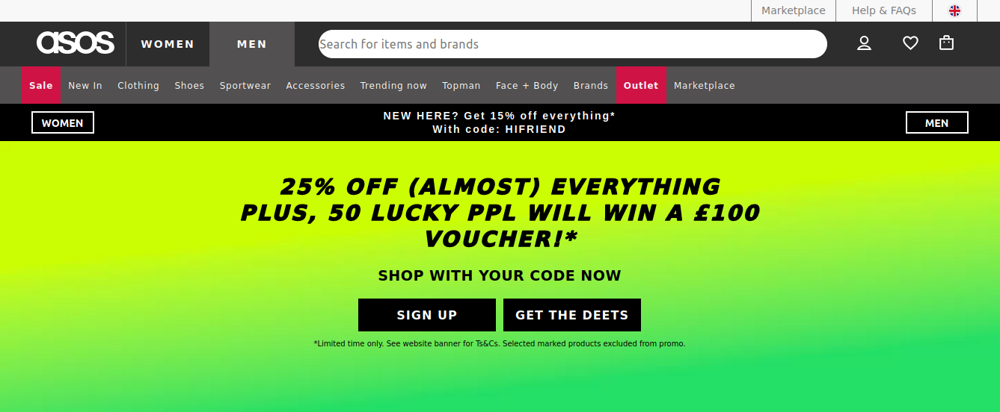
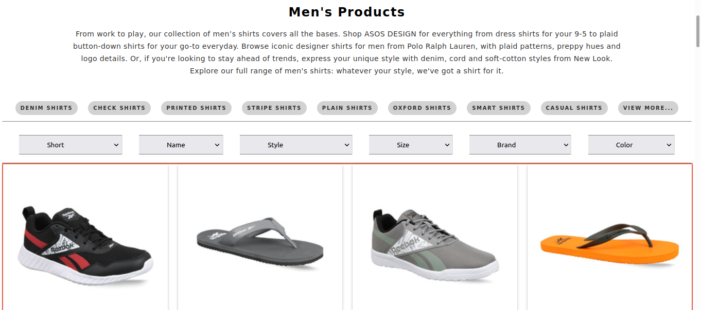
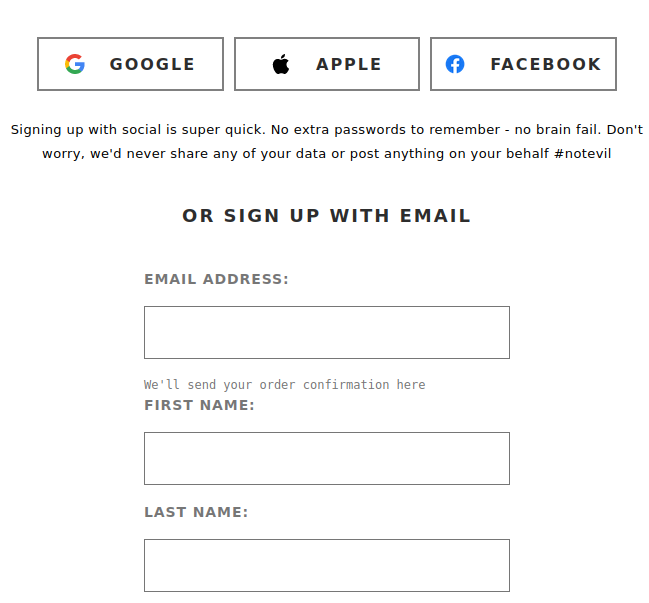
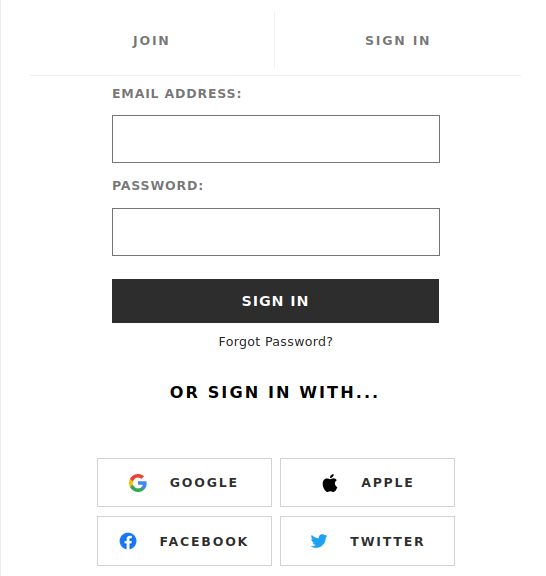

# asos.com-clone
**E-commerce clothing site clone with basic funcationality.**

## About
This is clone of shopping site. Asos.com is shopping site where user can buy clothes and various types of fashion product. This was a my first solo project. And I colmpleted in 5 days. I clone this site using HTML, CSS, Javascript with DOM technology. 

## Build with
- HTML
- CSS
- Javascript
- DOM

## Libraries used
-Fontawesome
-Icon8

## Main Funcationlity
- Landing page
- Social Sign-in/Sign-up
- Product category
- User authentication

# Related Links

## Blog
Asos.com [Read blog](https://medium.com/@baluramk6/clone-of-asos-com-50f37f2846a2).

## Live
Asos.com [Watch Live](https://asosclone.netlify.app/index.html).

## Home page

## Product Category

## Sign Up

## Sign In

